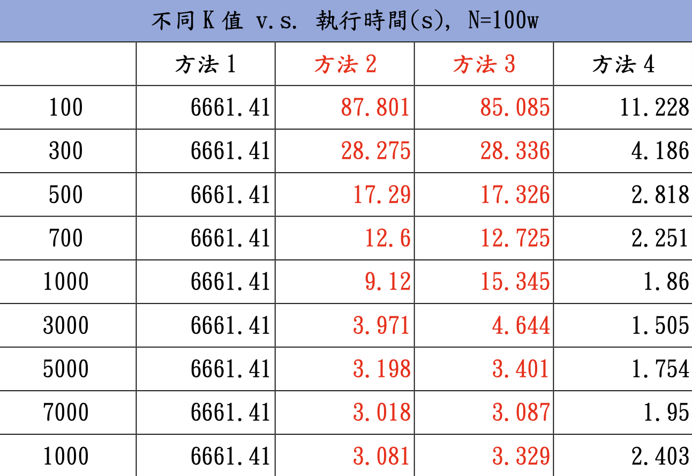
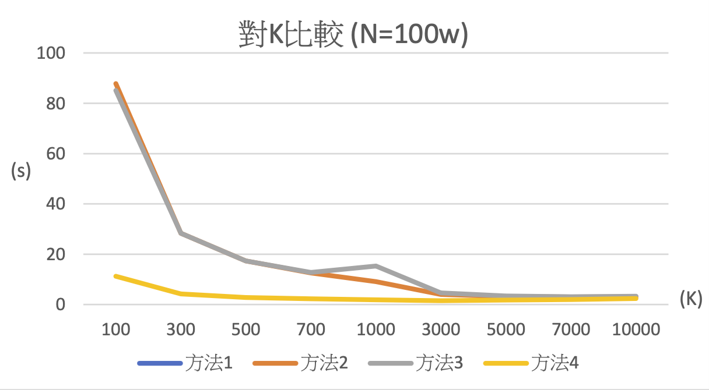
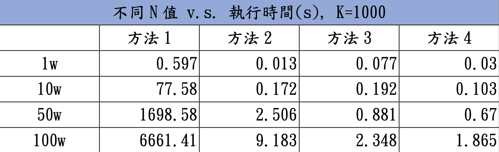
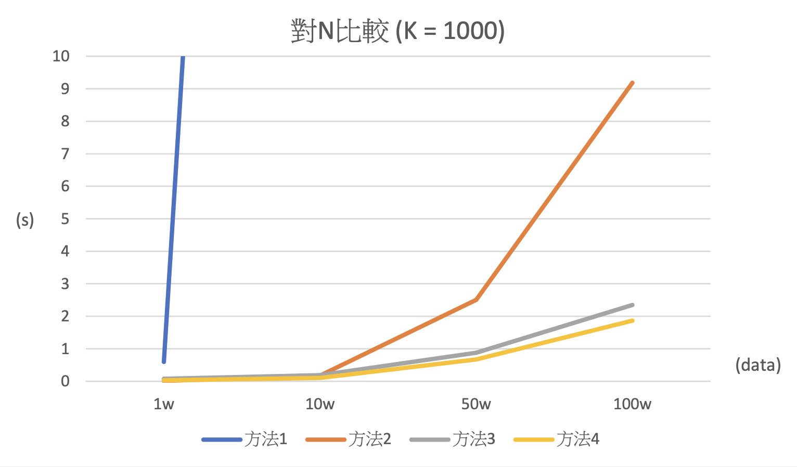
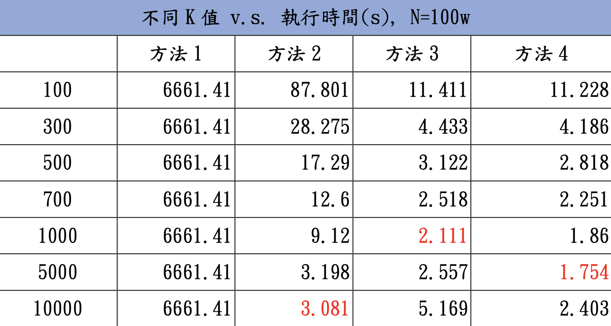
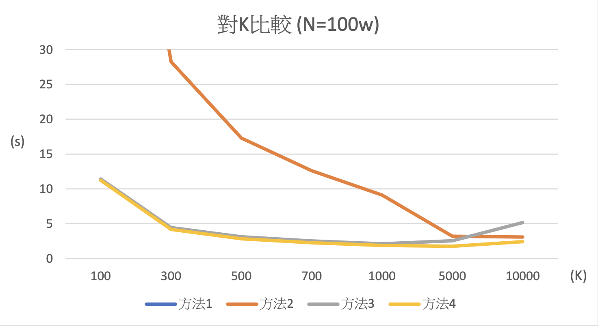
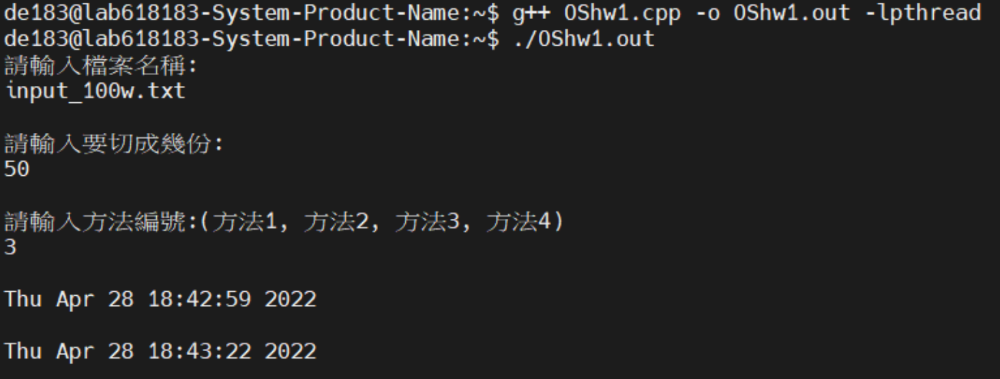
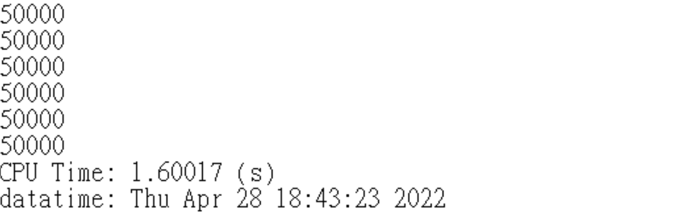

# 作業系統作業一 說明文件

## **作業說明**
實作多種排序策略，結合 Bubble Sort 與資料分割(Partitioning)，並透過不同執行方式(單執行緒、多程序、多執行緒)來比較效能差異。主要目標為分析：  
- 不同平行化方法的效能差異   
- Process 與 Thread 的執行成本  
- 資料切分數量 (K) 對效能的影響

## **實作方法和流程**
請使用者輸入檔名、檔案資料切的份數(K)、及欲使用的方法(1~4)，根據所輸入的檔名將檔案開啟，並將資料一一取出，存放於型別為`vector<int>`的 list中，並根據輸入的方法執行以下不同任務:  

- 方法一
    > 將list直接進行 Bubble Sort，再將結果輸出到output檔，並顯示CPU Time及Data Time。

- 方法二
    > 將list先等分成K份，每一份分別進行 Bubble Sort，再將K份執行完Bubble Sort 的資料Merge起來(採用K-way merge)，並將結果輸出到output檔，並顯示CPU Time及Data Time。

- 方法三
    > 將list先等分成K份，使用K個Process(es)進行Bubble Sort，等所有Bubble Sort 進行完後，再將K份資料以K-way merge的方式Merge起來，最後將結果輸出到output檔，並顯示CPU Time及Data Time。

- 方法四
    > 將list先等分成K份，使用K個Thread(s)進行Bubble Sort，等所有Bubble Sort 進行完後，再將K份資料以 K-way merge的方式 Merge起來，最後將結果輸出到 output檔，並顯示CPU Time及Data Time。

## **特殊機制考量與設計**
方法三一開始是以呼叫`vfork()`的方式進行，因為`vfork()`可以共享記憶體，但在計算執行時間時，發現方法二及方法三的執行時間極為接近，後來才發現，原來`vfork()`可以共享記憶體，是因為雖然開啟多個 Process，但每個 Process 並非平行處理，而是循序執行，也就是第一個 Process 執行完後才會換第二個 Process執行，這樣就跟執行方法二的效果沒太大差異。此種方法並非真正意義上的 MultiProcess，因此改以呼叫`fork()`的方式運作。  
  
  
由上述圖表可看出，方法二及方法三的執行時間十分接近

## **分析結果和原因**
### **不同N值 vs. 執行時間**  
  
  

由上述圖表可看出，在 K值固定為 1000的情況下，隨著資料筆數增加，執行時間也跟著上升，不過因為方法二會先將資料分成1000 份，再去執行 Bubble Sort，因此相較於方法一直接將N筆資料進行Bubble Sort，方法二的成長曲線較為平緩。  

而隨著資料筆數上升，可以看到方法三所需的時間略高於方法四，我認為可能的原因為: 一個Process會包含一至多個 Thread，而一個處理程序內的所有執行緒共用地址空間，因此Multi-thread在做Context Switch時，僅需儲存每個執行緒的程式計數器、暫存器及堆疊空間，所花的代價相較於 Multi-process 在做Context Switch 會輕很多，因此所花的時間也相對較少。

### **不同K值 vs. 執行時間**
  
  

由上述圖表可看出，在資料筆數(N)固定為100w的情況下，所切的份數(K)越多，執行方法二所需的時間越少，那是因為K越高，代表每一份的資料筆數就越少，執行 Bubble Sort的效率也就越高。

而方法三最佳執行效率是在 K=1000 時，我認為是因為如果K再持續增加的話，Multi-process在做Context Switch 所增加的時間，會比因為Multi-process 做Bubble Sort所減少的時間來的更多，因此 K=5000時的執行時間會比 K=1000 時更多。同理，方法四最佳執行效率是在 K=5000時，
若再往上增加的話，Context Switch所增加的時間會比因為 Multi-thread做Bubble Sort 所減少的時間來的更多。

## **撰寫程式時遇到的Bug及相關的解決方法**
執行方法三時，有遇過檔案輸出的 CPU Time跟實際執行時間差異非常大的情況，如圖: 執行100萬筆資料，等分成50份，使用方法三標示處為開始執行及執行結束的當下時間，執行時間大約為23秒，不過在最後輸出檔卻顯示 CPU Time只有約1.6秒。  
  
  
我認為原因為: 一開始計算時間所使用的是 clock()，然而當 ParentProcess 執行wait(0)時，會進入Waiting State，將CPU資源讓出給其他Process 使用，而在這期間，因為沒有占用 CPU資源，clock()並不會繼續計時，最後才導致以上說的 bug。

解決方法: 使用`std::chrono::system_clock`，改以絕對時間計算