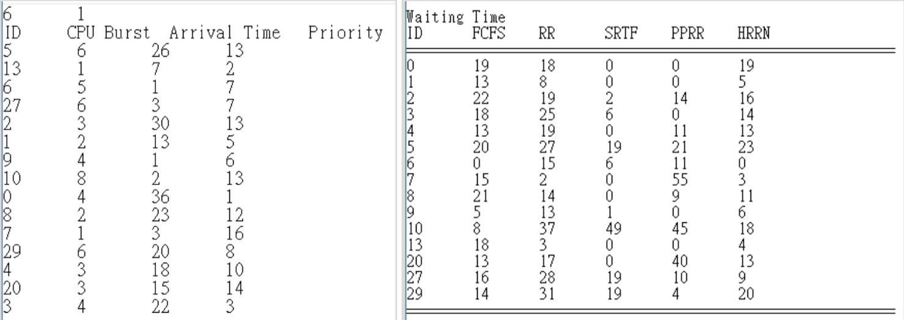
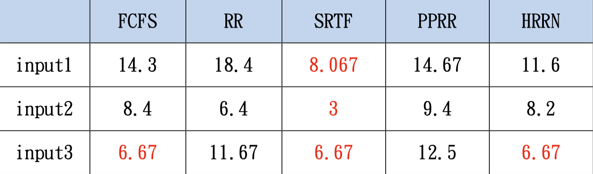
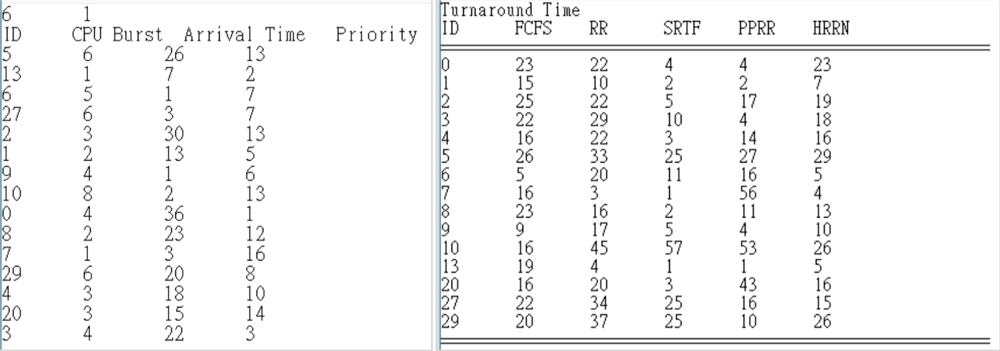
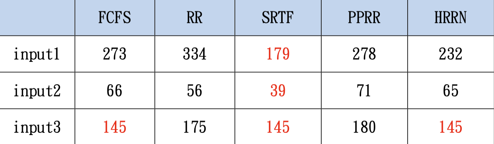

# 作業系統作業二 說明文件

## **作業說明**
實作多種 CPU 排程演算法（Scheduling Algorithms，透過模擬 Process 的執行流程，分析不同排程策略對於系統效能的影響。

系統會讀取輸入檔中的 Process 資訊，並依照指定排程方法進行模擬，最後輸出：
1. 甘特圖（Gantt Chart）
2. Waiting Time
3. Turnaround Time

## **實作方法和流程**
請使用者輸入檔名，根據所輸入的檔名將檔案開啟，並將資料一一取出，存放於型別為`vector<Process>`的list中(list中的每一元素會存放Process的`PID`, `CPU Burst Time`, `Arrival Time`和`Priority`的資料)，並根據檔案所指定的方法及所提供的Time Slice 執行以下不同排程方法:

- 方法一 - FCFS (First Come First Serve)
    > 依Arrival Time 的先後次序進行排程，時候未到的Process 不能執行；若Arrival Time 相同，則依Process ID由小到大依序處理。

- 方法二 - RR (Round Robin)
    > 依Arrival Time 的先後次序進行排程，時候未到的Process 不能執行；若Arrival Time 相同，則依Process ID由小到大依序處理；  
    而若正在等待被執行的 Process不只一個時，須以輪流的方式進行排程，每個Process 每次能執行time_slice 的時間單位；  
    當Timeout 時，被換下的Process 要從等待佇列尾端開始排序，若剛好有新來的Process，則讓新來的Process 排在前面；  
    若Process 做完但time_slice卻未用完，則換下一個Process 執行且擁有完整的time_slice
    
- 方法三 - SRTF (Shortest Remaining Time First)
    > 依剩餘CPU Burst最小的Process 先排序，時候未到的Process不能執行；若剩餘 CPU Burst相同的Process不只一個，則Arrival Time 小的先處理；若剩餘CPU Burst相同且Arrival Time相同，則依Process ID 由小到大依序處理。
    
- 方法四 - PPRR (Preemptive Priority + Round Robin)
    > 依Priority大小依序處理，Priority Number小的代表優先級較高，須優先處理，時候未到的Process 不能執行；若Priority相同的Process不只一個，則採用RR原則進行排程:    
    - 若有Priority相同的Process 正在執行，需等待其time_slice用鑿；
    - 當Timeout(time_slice用鑿)或被Preemptive時，從等待佇列尾端開始依Priority大小排序，若剛好有新來的Process，則讓新來的Process 排在前面。  

- 方法五 - HRRN (Highest Response Ratio Next)
    > 反應時間比率(Response Ratio)愈高的Process優先處理，時候未到的Process不能執行；若Ratio相同的Process不只一個，則Arrival Time小的先處理；若剩餘Ratio 相同且Arrival Time 相同，則依Process ID 由小到大依序處理。  
    `Ratio = (Waiting Time + CPU Burst Time) / CPU Burst Time`    

- 方法六 - ALL
    > 將方法一～方法五都執行一遍。   
    
執行以上方法時也須記錄排程甘特圖、每個Process的Waiting Time、Turnaround Time，待排程結束後，將方法名稱、該方法對應的甘特圖、各個Process ID在各個方法(可能數個)的Waiting Time、各個Process ID在各個方法(可能數個)的Turnaround Time 輸出到 output檔。
    
## **不同排程法的比較**
### **平均等待時間（Average Waiting Time）**
以input1.txt 為例(方法六, Time Slice為1)，左圖為輸入檔案內容，右圖為output檔內容，記錄各個Process ID在各個方法中的Waiting Time。
  

下表為 input1.txt, input2.txt, input3.txt各個方法的Average Waiting Time:  
  

Waiting Time 為Process在queue 中等待被CPU執行的時間，而從上表中可以看出，無論輸入哪個檔案，Shortest Remaining Time First排程皆可得到最小的平均等待時間，我認為原因是此排程每次都會在waiting queue中挑出CPU Burst Time最小的Process 去執行，因此減少許多Process在waiting queue 等待的時間。

### **工作往返時間（Turnaround Time）**
以input1.txt 為例(方法六, Time Slice為1)，左圖為輸入檔案內容，右圖為output檔內容，記錄各個Process ID在各個方法中的Turnaround Time。
  

下表為 input1.txt, input2.txt, input3.txt各個方法的Turnaround Time的總和:  
  

Turnaround Time為Process向 CPU發出請求到Process 執行完所經過的時間(也就是Waiting Time 加上CPU Burst Time)，而從上表中可以看出，無論輸入哪個檔案，Shortest Remaining Time First 排程的Turnaround Time總和皆是最小，原因我認為和平均等待時間一樣，此排程每次都會在waiting queue 中挑出CPU Burst Time 最小的Process去執行，因此減少許多Process 在waiting queue 等待的時間，Turnaround Time也就跟著少了許多。

## **結果與討論**
從以上不同排程法中可以得知，Shortest Remaining Time First 排程法的平均等待時間與工作往返時間皆為所有排程法中最小的，因此若以追求最短等待時間作為評斷標準，理論上Shortest Remaining Time First 可以說是最佳的排程演算法，不過實務上卻很難執行，因為有時無法在 Process向CPU 發出請求時就得知Process的CPU Burst Time，也就無法有效使用此排程法。

而SRTF排程法每次都是挑剩餘執行時間最小者，PPRR為挑選Priority最小者，因此有可能會發生Starvation，進而導致Process deadlock；然而FCFS 是以Arrival Time 為排序依據，RR為Process輪流使用 CPU資源，HRRN有Response Ratio 當作評斷標準，等待時間越多，Ratio 值越高，越容易被選中執行，因此這三種並不會發生Starvation，也就不會導致Process deadlock。