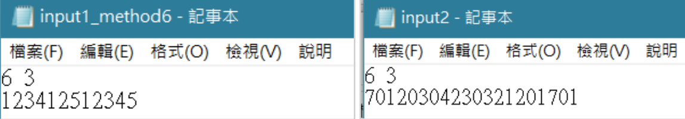
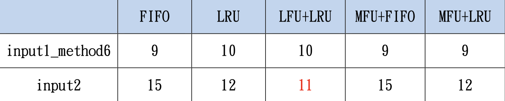
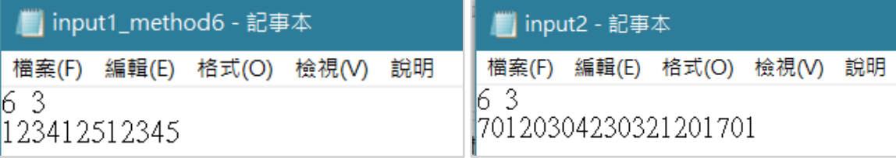
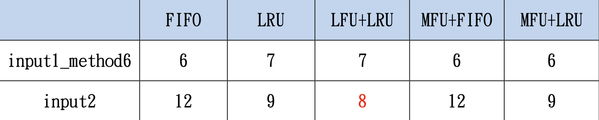
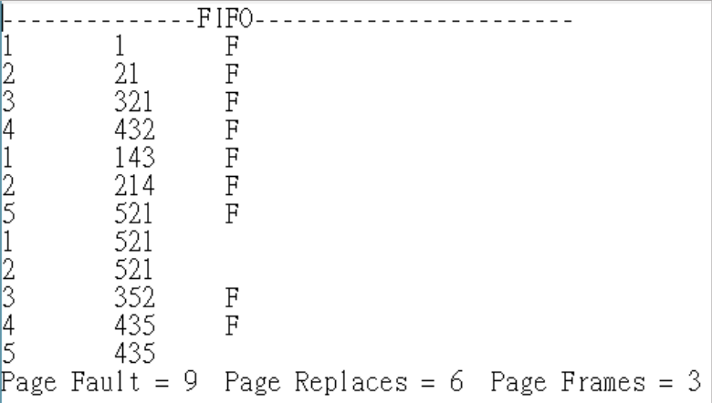
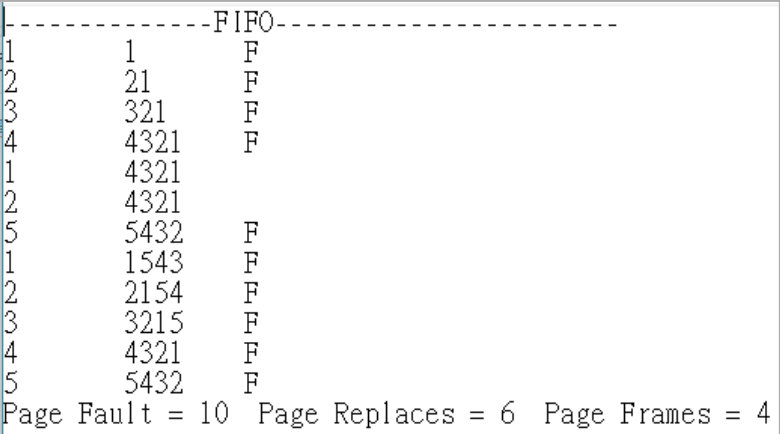

# 作業系統作業三 說明文件

## **作業說明**
實作多種Page Replacement 演算法，模擬作業系統在記憶體管理中，當Page Frames 不足時的置換策略。

透過不同演算法比較：
1. Page Fault 次數
2. Page Replacement 次數
3. 記憶體使用效率

## **實作方法和流程**
請使用者輸入檔名，根據所輸入的檔名將檔案開啟，並將資料取出，分別存於command, frame 兩個變數中，並將檔案中剩下的資料以陣列型別取出，存放於型別為`vector<Page>`的list 中(list中的每一元素會存放Process的Page Reference 及count(若 Queue內的頁框被參考或存取時會需要用到count 計數)，並根據檔案所指定的方法及所提供的frame 執行以下不同置換法:

- 方法一 - FIFO (First In First Out)
    > 當某頁被載入頁框時，便以時間標記(Time Stamp)記錄時間，當發生頁置換時(Page Replacement)，將時間標記最小的頁，也就是在主記憶體內最久的頁置換出。

- 方法二 - LRU (Least Recently Used)
    > 當某頁被載入頁框時，便以時間標記記錄時間，而除了載入時給予時間標記外，每次此頁被參考到時，便重新給予一個新的時間標記，當發生頁置換時(Page Replacement)，將過去最久不被使用到的頁置換出。

- 方法三 - LFU(Least Frequently Used) + LRU
    > 當某頁被載入頁框時，便以時間標記(Time Stamp)記錄時間，每次此頁被參考到(Reference)時，便重新給予一個新的時間標記，此外，每個頁框均有一個對應之計數器(count)， 它的起始值為0，當某個頁框被參考或修改時， 計數器便被加1，當發生頁置換時(PageReplacement)，將count值最小的頁框作頁置換，若有兩個以上的頁count一樣，則採用LRU置換法，將過去最久不被使用到的頁置換出。
    
- 方法四 - MFU(Most Frequently Used) + FIFO
    > 當某頁被載入頁框時，便以時間標記(Time Stamp)記錄時間，每次此頁被參考到(Reference)時，便重新給予一個新的時間標記，此外，每個頁框均有一個對應之計數器(count)， 它的起始值為0，當某個頁框被參考或修改時， 計數器便被加1，當發生頁置換時(PageReplacement)，將count值最大的頁框作頁置換，若有兩個以上的頁count一樣，則採用FIFO置換法，將時間標記最小的頁，也就是在主記憶體內最久的頁置換出。  

- 方法五 - MFU(Most Frequently Used) + LRU
    > 當某頁被載入頁框時，便以時間標記(Time Stamp)記錄時間，每次此頁被參考到(Reference)時，便重新給予一個新的時間標記，此外，每個頁框均有一個對應之計數器(count)， 它的起始值為0，當某個頁框被參考或修改時， 計數器便被加1，當發生頁置換時(Page Replacement)，將count值最大的頁框作頁置換，若有兩個以上的頁count一樣，則採用LRU置換法，將過去最久不被使用到的頁置換出。    

- 方法六 - ALL
    > 將方法一～方法五都執行一遍。   
    
執行以上方法時也須記錄每個時間點的Page Frame、Page Fault及Page Replace的次數、當前時間點是否發生Page Fault，待執行結束後，將方法名稱、該方法對應的Page Reference String、Page Frame、Page Fault 及Page Fault、Page Replaces、Page Frames 的數值輸出到 output檔。
    
## **不同方法的比較**
### **Page Fault 次數**
以input1_method6.txt及input2.txt為例(方法六, Page Frames為3)，下圖為輸入檔案內容。
  
下表為 input1_method6.txt及 input2.txt各個方法的 Page Fault次數:  
  

Page Fault 為當需要參考某一 Page時，若該Page並未在Queue中，代表需要去OS中存取該Page 的資料，從input2.txt 的各個數據中可以看到，LFU+LRU置換法的Page Fault次數是最低的，其原因我認為是因為他根據以往的數據，當發生頁置換時，優先將最不常使用到的頁置換出去，才會相較其他方法有比較好的表現。

### **Page Replace 次數**
以input1_method6.txt及input2.txt為例(方法六, Page Frames為3)，下圖為輸入檔案內容。
  

下表為 input1_method6.txt及 input2.txt各個方法的 Page Replace次數:   
  

Page Replace 為當需要參考某一Page時，發現主記憶體內所有頁框均被使用，此時需要找到一個犧牲者進行頁置換，從input2.txt 的各個數據中可以看到，LFU+LRU置換法的Page Replace次數是最低
的，其原因我認為是因為他根據以往的數據，當發生頁置換時，優先將最不常使用到的頁置換出去，才會相較其他方法有比較好的表現。

## **結果與討論**
### **畢雷笛反例(Belady’s Anomaly)**
所謂畢雷笛反例，是指採用FIFO 演算法時，增加頁框(Page Frames)數時，反而造成更多的Page Fault 及Page Replacement。  
  
  

上圖為輸入相同Page Reference 的次序，而Page Frames不同的輸出內容，可以看到當Page Frames = 3時，Page Faults = 9，而當Page Frames = 4時，Page Faults = 10，不減反增，因此可以知道，光是增加頁框數，不一定保證Page Fault 就能下降。

綜合以上結果，我認為除非能預先看到未來的Page，進而設計一個最佳頁置換法，否則其他頁置換換法的表現其實相差不多，但這基本上是不可能被實現。